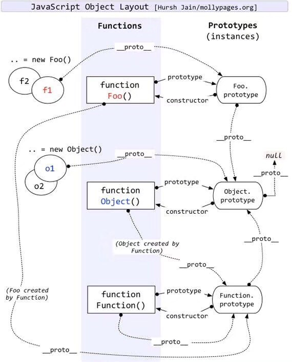

## 1. 简单继承
```js
function Person(name, age) {
  this.name = name;
  this.age = age;
}
Person.prototype.say = function() {
  console.log(`my name is ${this.name}, years old is ${this.age}`)
}

function Student(school) {
  this.school = school
}
Student.prototype.getSchool = function() {
  console.log(`my school name is ${this.school}`)
}


Student.prototype = new Person()
Student.prototype.constructor = Student;

const stu1 = new Student('清华')
console.log(stu1);

// 此种继承的缺点
// 1. 子类不能获取父类的属性
// 2. 子类的原型方法被替换掉了
```
## 2. 冒充对象继承
```js
function Person(name, age) {
  this.name = name;
  this.age = age;
}
Person.prototype.say = function() {
  console.log(`my name is ${this.name}, years old is ${this.age}`)
}

function Student(name, age, school) {
  Person.call(this, name, age)
  this.school = school
}
Student.prototype.getSchool = function() {
  console.log(`my school name is ${this.school}`)
}


// Student.prototype = Person.prototype
// 当时认为这样也可以实现继承，但是有一个缺点是：
// 当去修改了子类原型身上的say方法时，其父类的say方法就会被替换，导致后面在创建person对象时say方法就被替换掉了
// 我们并不希望此类事件发生，所以我们要使用new Person()来规避这个问题
Student.prototype = new Person()
Student.prototype.constructor = Student;
// Student.prototype.say = function() {
//   console.log('我被修改了');
// }

const stu1 = new Student('小明', 18, '清华')
stu1.say()
// const person = new Person('12', 18);
// person.say()


// 优化1继承.js使用冒充对象call来构造复制父类的方法到子类
// 缺点
//  1. 父类被new了2次，浪费性能
//  2. 仍旧存在子类的原型方法被替换掉了

```

## 3. 冒充对象和借用构造函数继承
```js
function Person(name, age) {
  this.name = name;
  this.age = age;
}
Person.prototype.say = function() {
  console.log(`my name is ${this.name}, years old is ${this.age}`)
}

function Student(name, age, school) {
  Person.call(this, name, age)
  this.school = school
}
Student.prototype.getSchool = function() {
  console.log(`my school name is ${this.school}`)
}

function Extends(parent) {
  // 借用另外一个中间函数
  function middle() {}
  middle.prototype = parent.prototype;
  return new middle()
}

Student.prototype = Extends(Person);
Student.prototype.constructor = Student;

const stu1 = new Student('小明', 18, '清华')
console.log(stu1);

// 父类不在被new 多次
// 缺点：
//  仍旧存在子类的原型方法被替换掉了

```

## 4. 寄生组合式继承 方式1
#### 将子类原型的`__proto__`属性指向父类对象
```js
function Person(name, age) {
  this.name = name;
  this.age = age;
}
Person.prototype.say = function() {
  console.log(`my name is ${this.name}, years old is ${this.age}`)
}

function Student(name, age, school) {
  Person.call(this, name, age)
  this.school = school
}
Student.prototype.getSchool = function() {
  console.log(`my school name is ${this.school}`)
}


function Extends(parent) {
  // 借用另外一个中间函数
  function middle() {}
  middle.prototype = parent.prototype;
  return new middle()
}

Student.prototype.__proto__ = Extends(Person);

const stu1 = new Student('小明', 18, '清华')
console.log(stu1);
stu1.getSchool()

//  子类原型不在被替换

```

## 5. 寄生组合式继承 方式2
#### 使用`Object.setPrototypeOf`属性，实现将子类原型的`__proto__`属性指向父类对象
```js
function Person(name, age) {
  this.name = name;
  this.age = age;
}
Person.prototype.say = function() {
  console.log(`my name is ${this.name}, years old is ${this.age}`)
}

function Student(name, age, school) {
  Person.call(this, name, age)
  this.school = school
}
Student.prototype.getSchool = function() {
  console.log(`my school name is ${this.school}`)
}
function Extends(son, parent) {
  Object.setPrototypeOf(son.prototype, parent.prototype)
  // son.prototype.__proto__ = parent.prototype
}


Extends(Student, Person);

const stu1 = new Student('小明', 18, '清华')
stu1.getSchool()

// setPrototypeOf
```
## 6.原型链继承图
